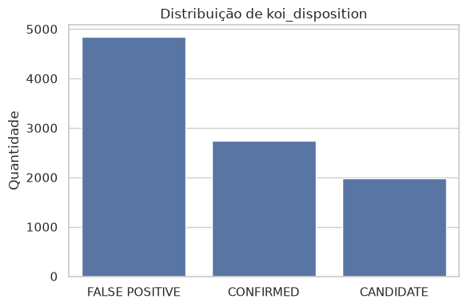
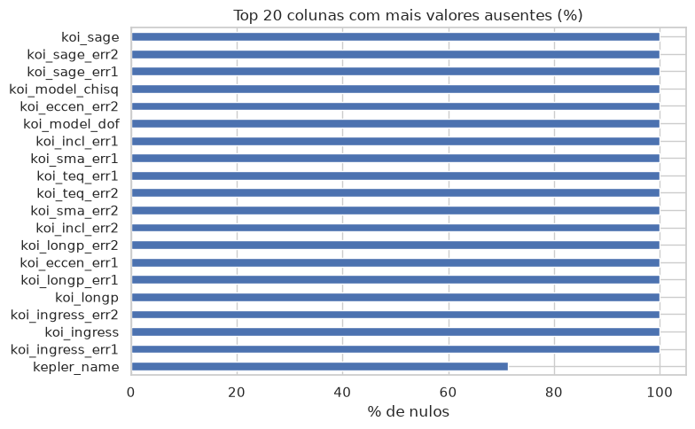
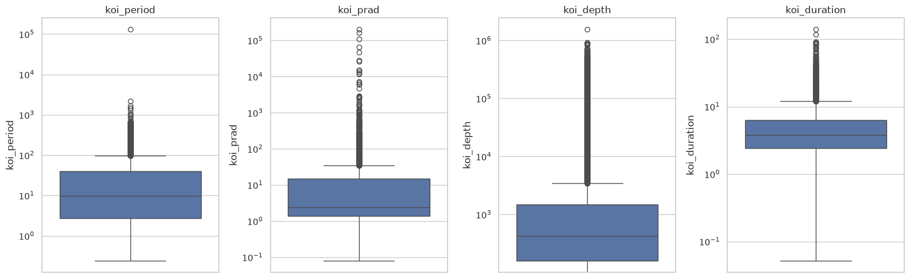
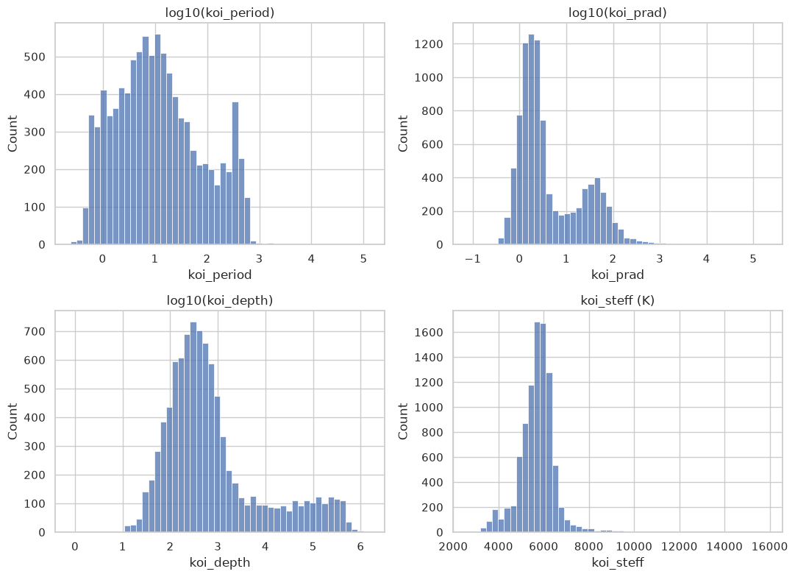
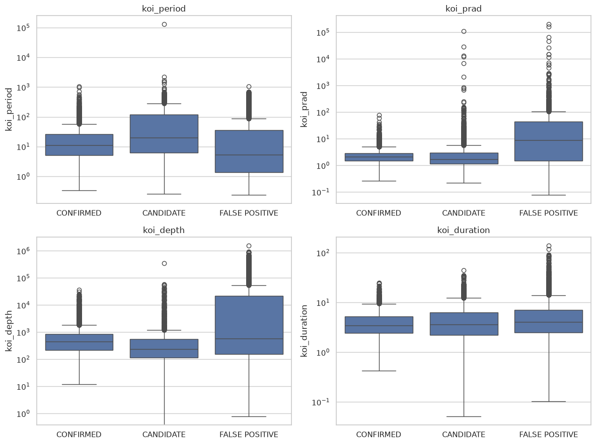
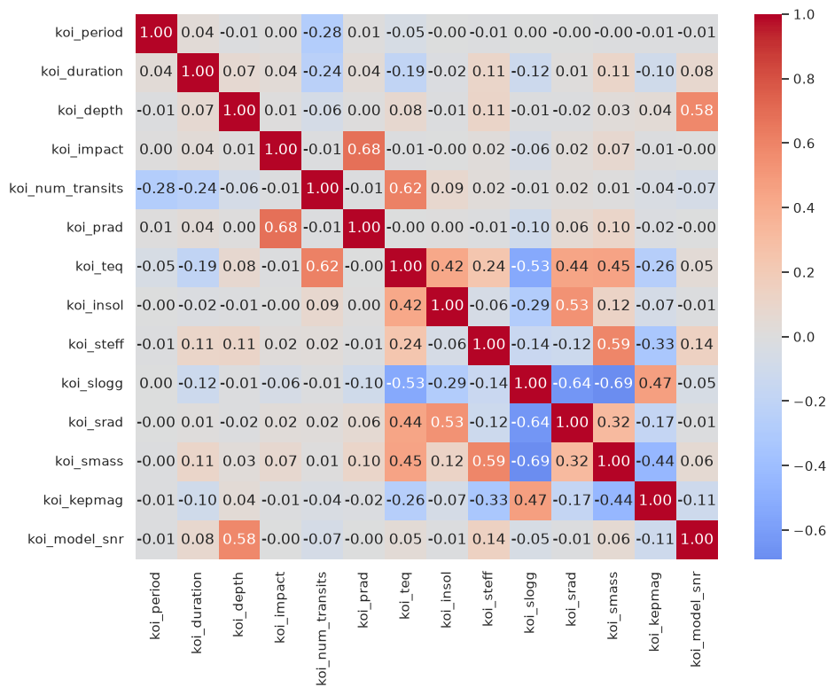

# Análise exploratória — ExoPredict Cloud

Relatório de acompanhamento da EDA feita em [`notebooks/01_eda.ipynb`](../notebooks/01_eda.ipynb) sobre a tabela `koi_raw` (catálogo Kepler KOI, ver [`data/README.md`](../data/README.md)). Este documento é atualizado a cada bloco de análise concluído; o notebook contém o código completo e é a fonte da verdade — aqui ficam os achados e as conclusões que embasam as próximas etapas do projeto.

## 1. Visão geral

- **9.564 linhas × 141 colunas.**
- **46 colunas** são de incerteza (`_err1`/`_err2`) — quase 1/3 da tabela não é medida em si, é metadado de qualidade de outra coluna.
- **95 colunas** restantes são medidas, flags e metadados.
- Tipos: `float64` (98), texto (36, entre `object` e `string`), `int64` (7).

## 2. Distribuição do alvo (`koi_disposition`)

| classe | quantidade | % |
|---|---|---|
| FALSE POSITIVE | 4.839 | 50,6% |
| CONFIRMED | 2.747 | 28,7% |
| CANDIDATE | 1.978 | 20,7% |

**Conclusão:** desbalanceamento moderado (razão ~2,4x entre a maior e a menor classe), não extremo. Técnicas simples (peso de classe no modelo, talvez leve oversampling) devem bastar — não é o cenário de classe rara (ex: 99%/1%) que exigiria SMOTE agressivo. `FALSE POSITIVE` ser maioria é coerente: a maior parte dos sinais de trânsito detectados automaticamente não é planeta real.

## 3. Valores ausentes

- **120 de 141 colunas** têm ao menos um nulo.
- **19 colunas 100% nulas** (batem com o check já existente em `src/validate_data_quality.py`) — candidatas a descarte direto.
- **`kepler_name` (71,3% nulo)** é um caso à parte: só é preenchida quando o KOI foi oficialmente confirmado como planeta e recebeu nome. Ou seja, não é nulo por falha de coleta — é um **vazamento de alvo** (não-nulo ⇒ `CONFIRMED`). Some-se à lista de colunas de saída do vetting já apontada em `data/README.md`.

Distribuição por faixa de % de nulo:

| faixa | nº de colunas |
|---|---|
| 0–5% | 70 |
| 5–20% | 30 |
| 20–50% | 0 |
| 50–80% | 1 (`kepler_name`) |
| 80–100% | 19 |

**Conclusão:** não há colunas "no meio do caminho" — ou estão quase completas (<20% nulo, seguras para imputar) ou praticamente/totalmente vazias (descartar ou tratar como vazamento). Isso simplifica a futura etapa de limpeza. Destaque: `koi_score` (15,8% nulo) e `koi_comment` (12,6%) já eram candidatas a vazamento; as demais colunas nessa faixa (`koi_fwm_*`, `koi_dicco_*`, `koi_dikco_*`) são métricas de centroide/fotometria cujo nulo provavelmente reflete estrelas onde a medida não pôde ser calculada, não erro de coleta.

## 4. Duplicados

- **0 linhas** duplicadas por parâmetros físicos (`koi_period`, `koi_duration`, `koi_depth`, `koi_prad`) — sem duplicidade de exportação.
- **1.350 `kepid` duplicados**, com 8.214 estrelas únicas para 9.564 KOIs — ou seja, várias estrelas têm mais de um KOI associado (sistemas multi-planetários, ex.: Kepler-90). Isso é esperado fisicamente, não é problema de qualidade de dado.

## 5. Outliers nas variáveis físicas principais

Boxplots em escala log de `koi_period`, `koi_prad`, `koi_depth` e `koi_duration` (escala log necessária: distribuição de cauda longa, comum em grandezas astronômicas).

Percentual de outliers pelo critério IQR (1,5×IQR):

| coluna | % outliers (IQR) |
|---|---|
| koi_period | 16,4% |
| koi_prad | 16,0% |
| koi_depth | 19,5% |
| koi_duration | 9,1% |

**Conclusão preliminar:** percentuais altos são esperados em distribuição assimétrica — o critério IQR clássico marca boa parte da cauda longa como "outlier" mesmo sendo fisicamente válido (ex.: períodos orbitais longos, planetas gigantes reais existem).

**Achado relevante:** os valores mais extremos de `koi_prad` (até ~200.000 raios terrestres — maior que muitas estrelas) são quase todos `FALSE POSITIVE` com `koi_score` nulo (não vetted), com 2 exceções em `CANDIDATE` também com score nulo. Isso não é um outlier estatístico "válido só que raro": é fisicamente impossível para um planeta real, provável sintoma de ajuste de trânsito malsucedido (ex.: binária eclipsante, trânsito rasante). **Implicação para a limpeza:** `koi_score` nulo já é, por si, um sinalizador de qualidade da medida; `koi_prad` acima de escala estelar (~100 R⊕) merece tratamento específico, não só winsorização estatística cega.

## 6. Distribuições das variáveis físicas principais

Histogramas de `koi_period`, `koi_prad` e `koi_depth` em `log10` (dada a cauda longa observada no bloco 5), e `koi_steff` (temperatura estelar) em escala natural.

| coluna | count | mean | std | min | 25% | 50% | 75% | max |
|---|---|---|---|---|---|---|---|---|
| koi_period | 9.564 | 75,67 | 1334,74 | 0,24 | 2,73 | 9,75 | 40,72 | 129.995,78 |
| koi_prad | 9.201 | 102,89 | 3077,64 | 0,08 | 1,40 | 2,39 | 14,93 | 200.346,00 |
| koi_depth | 9.201 | 23.791,34 | 82.242,68 | 0 | 159,90 | 421,10 | 1.473,40 | 1.541.400,00 |
| koi_steff | 9.201 | 5706,82 | 796,86 | 2.661 | 5.310 | 5.767 | 6.112 | 15.896 |

**Conclusões:**
- `koi_prad` em log é **bimodal** (pico perto de 1 R⊕ e outro perto de 30–100 R⊕) — coerente com a população real de exoplanetas (rochosos pequenos vs. gigantes gasosos), possivelmente amplificado pelos falsos positivos de raio inflado já identificados no bloco 5.
- `koi_depth` em log fica próxima de uma normal — boa candidata a transformação log como feature para modelagem.
- `koi_steff` já é bem comportada sem transformação — esperado, já que o Kepler mirou predominantemente estrelas tipo Sol (pico ~5700K).
- **`koi_depth == 0` em 1 única linha** (`K00126.02`, `CANDIDATE`, `koi_score` 0,997) — caso isolado, provavelmente `0` usado como placeholder em vez de `NaN` na exportação original. Não é padrão sistemático, mas precisa ser convertido para `NaN` antes de aplicar log na etapa de transformação.

## 7. Variáveis físicas por classe

Boxplot (escala log) de `koi_period`, `koi_prad`, `koi_depth` e `koi_duration` agrupados por `koi_disposition`, para antecipar quais variáveis têm poder de separação entre classes.

Mediana por classe:

| classe | koi_period | koi_prad | koi_depth | koi_duration |
|---|---|---|---|---|
| CONFIRMED | 11,35 | 2,16 | 448,60 | 3,49 |
| CANDIDATE | 20,04 | 1,74 | 242,00 | 3,61 |
| FALSE POSITIVE | 5,24 | 8,97 | 575,95 | 4,06 |

**Conclusões:**
- `koi_prad` e `koi_depth` separam bem `FALSE POSITIVE` das outras duas classes (mediana de raio ~9 R⊕ vs. ~2 R⊕) — coerente com o achado do bloco 5 de que raios inflados vêm majoritariamente de ajustes de trânsito malsucedidos. Fortes candidatas a features com poder preditivo real.
- `koi_duration` mostra pouca diferença entre classes — candidata a feature de menor poder preditivo isolado.
- `koi_period`: `CANDIDATE` tem mediana maior (~20 dias) que `CONFIRMED` (~11 dias). Provável viés observacional (períodos longos geram menos trânsitos na janela do Kepler, dificultando confirmação) mais do que uma diferença física real entre as classes — não interpretar como "candidatos têm períodos maiores por natureza".

## 8. Correlação entre variáveis numéricas

Heatmap de correlação sobre um conjunto curado de variáveis físicas interpretáveis (não as 141 colunas — as `_err1`/`_err2` são metadados redundantes por definição, ver bloco 1): geometria do trânsito, características do planeta inferido, características da estrela hospedeira e qualidade do sinal.

**Conclusões:**
- Nenhum par passa de 0,9 — não há sinal de multicolinearidade severa que obrigue a descartar variáveis nesta fase.
- Pares com correlação moderada e fisicamente explicável: `koi_prad`↔`koi_impact` (0,68 — trânsitos mais rasantes tendem a inflar a estimativa de raio, reforça o achado dos blocos 5–6), `koi_teq`↔`koi_num_transits` (0,62 — planetas mais quentes/próximos têm período menor, logo mais trânsitos na janela do Kepler), `koi_depth`↔`koi_model_snr` (0,58 — trânsito mais profundo, sinal mais forte), e o cluster de propriedades estelares (`koi_slogg`, `koi_srad`, `koi_smass`, `koi_steff`) correlacionado entre si, como esperado de relações astrofísicas conhecidas (evolução estelar).
- Nenhuma dessas relações é redundância de dado (duas colunas medindo a mesma coisa) — são relações físicas reais entre grandezas distintas, então não há razão para eliminar variáveis só por causa desta matriz.

---

## Resumo executivo

A EDA completa (8 blocos) está concluída. Principais decisões que ela embasa para as próximas etapas do checklist:

1. **Vazamento de alvo** — além de `koi_disposition`, `koi_pdisposition`, `koi_score`, `koi_comment` (já apontados em `data/README.md`), a EDA identificou `kepler_name` como vazamento estrutural (só preenchido quando `CONFIRMED`).
2. **Colunas a descartar** — 19 colunas 100% nulas (bloco 3); as ~46 colunas `_err1`/`_err2` precisam de decisão específica (usar como incerteza relativa ou descartar), não tratamento igual às medidas.
3. **Qualidade de dado a corrigir na limpeza** — `koi_depth == 0` (1 linha, placeholder), `koi_prad` acima de escala estelar concentrado em `FALSE POSITIVE`/score nulo (não é outlier estatístico comum).
4. **Desbalanceamento de classes** — moderado (~2,4x), não deve exigir SMOTE agressivo; `class_weight` deve bastar.
5. **Features com sinal aparente de poder preditivo** — `koi_prad`, `koi_depth` (separam bem `FALSE POSITIVE`); `koi_duration` mostrou pouca separação isolada.
6. **Transformações a considerar** — `log10` em `koi_period`, `koi_prad`, `koi_depth` (cauda longa); nenhuma variável do conjunto curado exige remoção por multicolinearidade severa.
