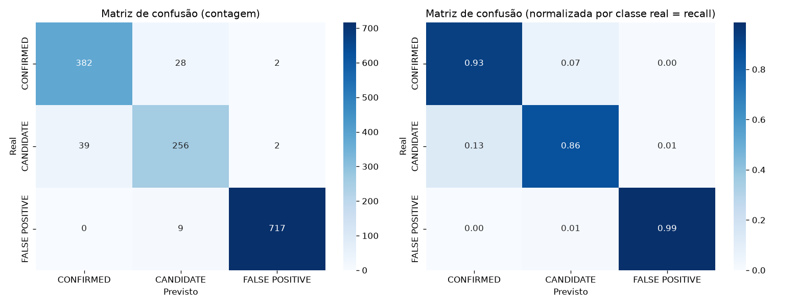

# Avaliação por classe e matriz de confusão — ExoPredict Cloud

Documenta `src/evaluate_model.py`: avaliação consolidada do modelo escolhido até aqui (Gradient Boosting, `class_weight="balanced"` — `reports/model_comparison.md` e `reports/imbalance.md`), treinado em `train.csv`, avaliado em `val.csv`.

## Por que a ordem das classes na matriz não é alfabética

`CONFIRMED`, `CANDIDATE`, `FALSE POSITIVE` — ordenado por "distância" científica do meio-termo, não por ordem alfabética. Isso deixa visualmente mais fácil enxergar o que importa: erros perto da diagonal entre `CONFIRMED` e `CANDIDATE` são "discordância de maturidade de confirmação"; erros que cruzam para `FALSE POSITIVE` são categoricamente diferentes — "isso é ou não é um sinal real".

## Métricas por classe

| classe | precisão | recall | F1 | suporte |
|---|---|---|---|---|
| CONFIRMED | 0,907 | 0,927 | 0,917 | 412 |
| CANDIDATE | 0,874 | 0,862 | 0,868 | 297 |
| FALSE POSITIVE | 0,994 | 0,988 | 0,991 | 726 |

## Matriz de confusão



| real \ previsto | CONFIRMED | CANDIDATE | FALSE POSITIVE |
|---|---|---|---|
| CONFIRMED | 382 | 28 | 2 |
| CANDIDATE | 39 | 256 | 2 |
| FALSE POSITIVE | 0 | 9 | 717 |

## Nem todo erro custa igual

O ponto central desta avaliação: **os dois tipos de erro mais graves cientificamente são quase inexistentes**.

- **`FALSE POSITIVE` previsto como `CONFIRMED`** (declarar um planeta que não existe): **0 casos** em 726 `FALSE POSITIVE` reais.
- **`CONFIRMED` previsto como `FALSE POSITIVE`** (descartar um planeta real): **2 casos** em 412 `CONFIRMED` reais (0,5%).

A esmagadora maioria dos 79 erros totais (39 + 28 + 9 + 2 + 0 + 1, ver matriz) está na fronteira `CONFIRMED` ↔ `CANDIDATE` (39 + 28 = 67 dos 79, ~85% dos erros). Isso é coerente com o que a comparação de modelos já havia notado (`reports/model_comparison.md`): essas duas classes têm perfil físico parecido — a diferença muitas vezes vem de confirmação observacional adicional que não está capturada nas variáveis de trânsito usadas aqui, não de o modelo "errar feio".

**Implicação prática:** se este modelo fosse usado para priorizar candidatos para observação de acompanhamento, o risco de desperdiçar tempo de telescópio confirmando um falso positivo (ou de descartar um planeta real por engano) é muito baixo. O risco real é de ambiguidade entre "candidato" e "confirmado" — que é exatamente o tipo de erro mais aceitável nesse domínio, já que ambos já implicam "objeto de interesse", só difere o grau de certeza.

## Regenerar

```bash
python src/evaluate_model.py
```
