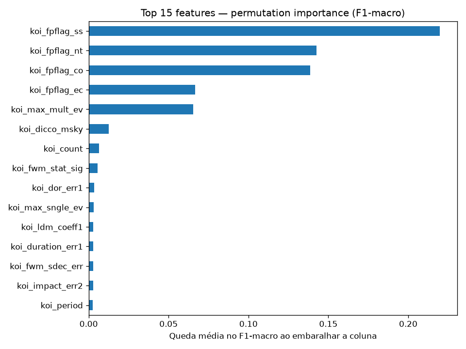
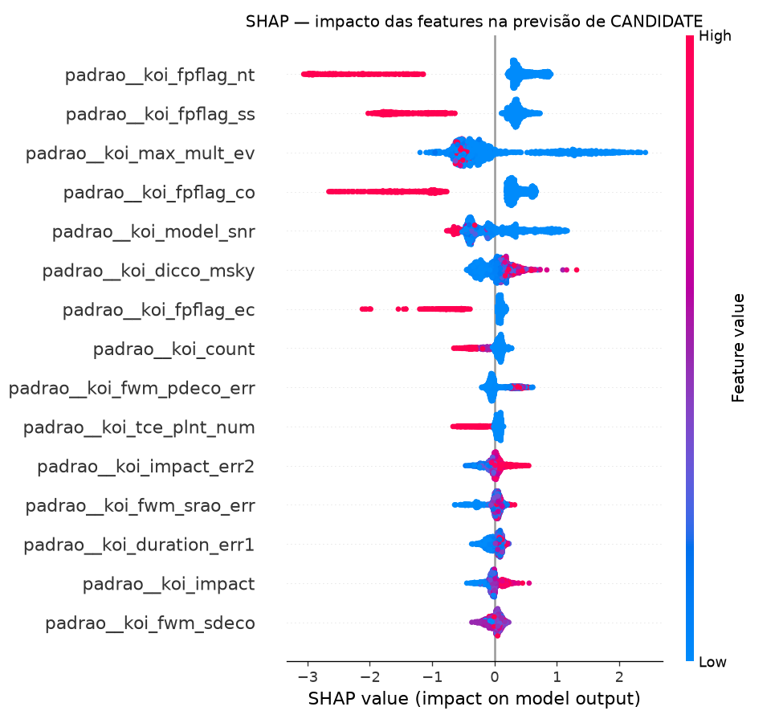
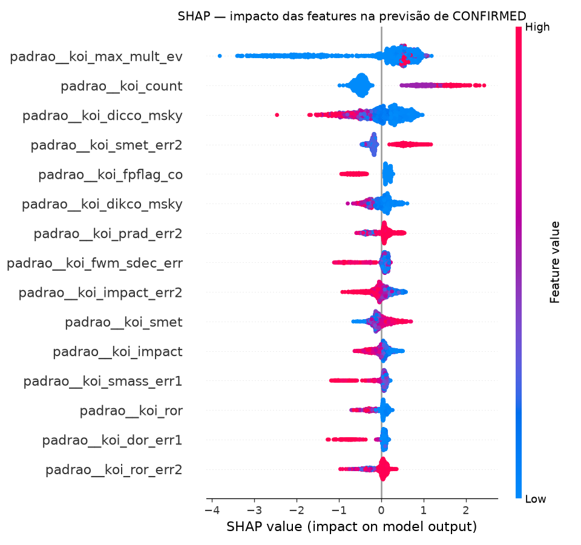
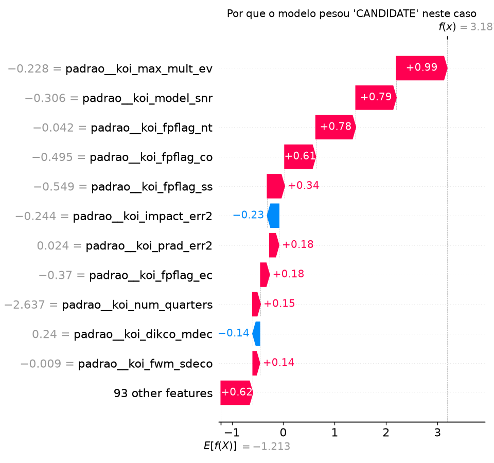

# Explicabilidade — ExoPredict Cloud

Documenta `src/explainability.py`, rodado sobre o modelo final (`models/gradient_boosting_v1.joblib`) e o conjunto de teste. A métrica final já está travada em `reports/final_model.md` — esta análise é descritiva, não realimenta nenhuma decisão de modelagem.

## Duas perguntas diferentes, duas ferramentas diferentes

- **"Quais features pesam mais no modelo como um todo?"** → `permutation_importance` (scikit-learn): embaralha cada coluna e mede quanto o F1-macro piora. Model-agnostic, funciona sobre o `Pipeline` inteiro.
- **"Por que o modelo decidiu isso *nesta* previsão específica?"** → SHAP (`TreeExplainer`), o padrão da área para explicação local em modelos de árvore.

## Importância global



As 4 flags automáticas (`koi_fpflag_ss`, `nt`, `co`, `ec`) dominam completamente — coerente com a decisão registrada em `reports/feature_selection.md` (usá-las como feature, não vazamento) e com o achado de `reports/evaluation.md` de que `FALSE POSITIVE` já sai quase perfeito. Elas resolvem a fatia "fácil" do problema e, por isso, também dominam a importância agregada — o que **esconde** o que realmente separa `CANDIDATE` de `CONFIRMED`, a fronteira difícil. Por isso a segunda camada de análise, por classe.

## O que separa CANDIDATE de CONFIRMED




Olhando por classe (não a importância agregada), aparecem features que não estavam no topo do ranking global:

- **`koi_max_mult_ev`** (estatística de evento múltiplo — força do sinal de trânsito somado) é a feature mais relevante para `CONFIRMED`: valores altos empurram a previsão para `CONFIRMED`, valores baixos para `CANDIDATE`. Faz sentido: um sinal mais forte estatisticamente é mais fácil de confirmar com segurança.
- **`koi_count`** (quantos planetas já são conhecidos naquele sistema estelar) também pesa bastante para `CONFIRMED`: sistemas que já têm outros planetas confirmados tendem a ter seus novos candidatos confirmados com mais frequência — reflete tanto astrofísica real (sistemas multi-planetários são mais estudados/verificados) quanto um viés observacional legítimo, não vazamento (é uma propriedade do sistema, não da disposição deste KOI específico).
- **`koi_model_snr`** (relação sinal-ruído do trânsito) segue o mesmo padrão de `koi_max_mult_ev`: sinal mais forte, mais confiança de confirmação.

## Um caso de erro, explicado



Um `CONFIRMED` real que o modelo previu como `CANDIDATE` (um dos 39 casos da matriz de confusão em `reports/evaluation.md`): `koi_max_mult_ev` e `koi_model_snr` relativamente baixos empurraram a previsão para `CANDIDATE`, mesmo o objeto sendo, de fato, um planeta confirmado. Leitura: é um planeta real, mas com sinal estatisticamente mais fraco que o típico `CONFIRMED` — o tipo de caso-limite que faz sentido um modelo (ou um cientista) hesitar antes de confirmar. Reforça a conclusão de `reports/evaluation.md`: esse é o erro mais aceitável possível neste domínio, não um sintoma de o modelo estar "quebrado".

## Regenerar

```bash
python src/explainability.py
```
